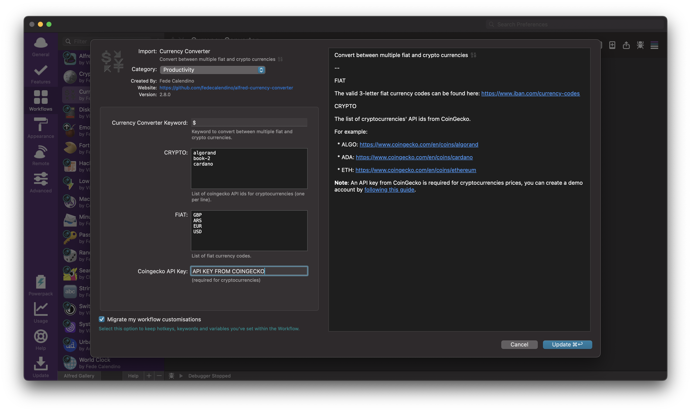
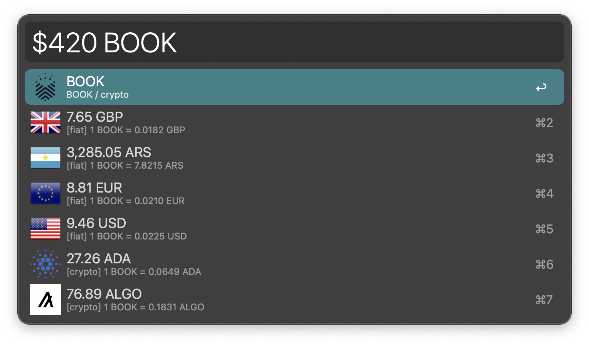

## ALFRED-CURRENCY-CONVERTER

[Alfred Workflow](https://www.alfredapp.com/workflows/) to convert between multiple fiat and crypto currencies 💱️

#### Configuration:

FIAT

The valid 3-letter fiat currency codes can be found here: https://www.iban.com/currency-codes

CRYPTO

The list of cryptocurrencies' API ids from CoinGecko.

For example:

  * ALGO: https://www.coingecko.com/en/coins/algorand
  * ADA: https://www.coingecko.com/en/coins/cardano
  * ETH: https://www.coingecko.com/en/coins/ethereum

**Note**: An API key from CoinGecko is required for cryptocurrencies prices, you can create a demo account by [following this guide](https://support.coingecko.com/hc/en-us/articles/21880397454233-User-Guide-How-to-use-Demo-plan-API-key-).

#### Usage:

